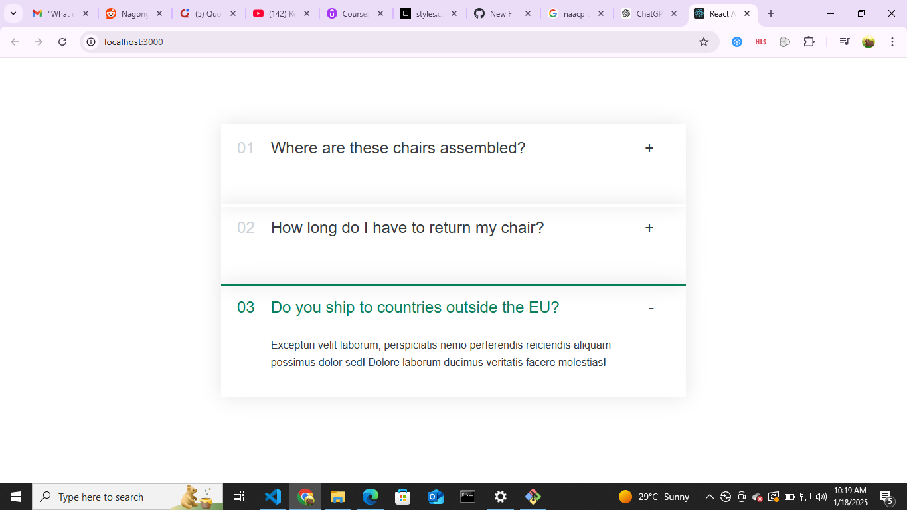
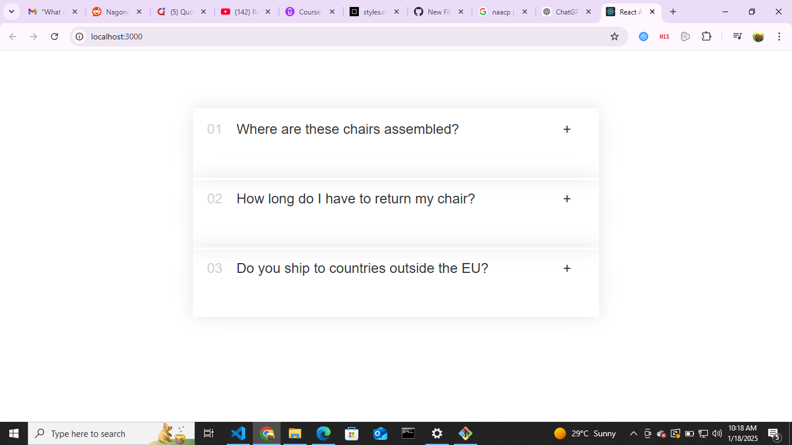

# React Accordion Component

This project demonstrates a simple **Accordion Component** built with React. Each accordion item can toggle between showing and hiding its content. The styling is applied through CSS, and the state management is handled using React's `useState` hook.

---

## Features

- Display a list of FAQs.
- Toggle visibility of content when clicking the item title.
- Dynamically renders accordion items from a data array.
- Simple and reusable component structure.

---

## Project Structure

The project includes the following files:

1. **App.js**: The root component of the app, rendering the Accordion component.
2. **Accordion.js**: Maps over FAQ data and renders individual `Item` components.
3. **Item.js**: Represents a single accordion item and handles its toggle functionality.
4. **style.css**: Provides the styling for the accordion.

---

## Screenshots

### Accordion Initial View


### Accordion Item Opened


---

## Setup and Installation

To run this project locally:

1. Clone the repository:
   ```bash
   git clone <repository_url>
   cd <repository_folder>
Install dependencies:

bash
Copy
Edit
npm install
Start the development server:

bash
Copy
Edit
npm start
Open your browser and navigate to http://localhost:3000.

FAQ Data
The accordion is powered by the faqs array, which contains a list of FAQ items:

javascript
Copy
Edit
const faqs = [
  {
    title: "Where are these chairs assembled?",
    text: "Lorem ipsum dolor sit amet consectetur..."
  },
  {
    title: "How long do I have to return my chair?",
    text: "Pariatur recusandae dignissimos fuga..."
  },
  {
    title: "Do you ship to countries outside the EU?",
    text: "Excepturi velit laborum..."
  }
];
You can customize this data or add more FAQ items as needed.

Technology Stack
React: For building the UI components.
CSS: For styling the components.
JavaScript: For component logic and state management.
License
This project is licensed under the MIT License. Feel free to modify and use it as per your needs